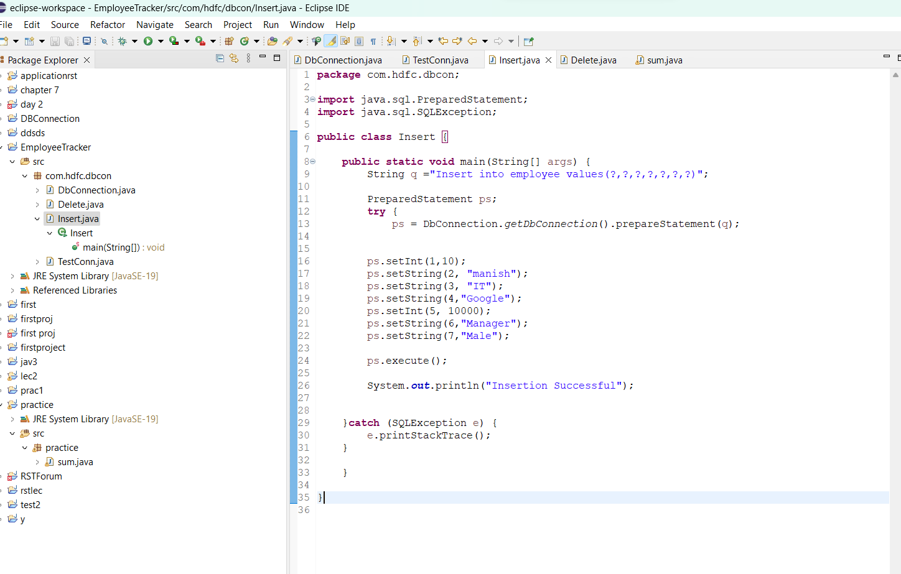

This is a mini project which I have created using Eclipse IDE for java ,linking it with MYSQL Workbench using a jar file, which is a driver. I have created a database called student_tracker-db , in which there is a table called employee. I have created methods to insert and delete records in the the database , directly from Eclipse IDE

## Requirements
* Java
* Eclipse IDE
* MySQl Workbench
* My SQL connector jar file

## Code 

* [Code](code/DbConnection.java)
* [Code](code/Delete.java)
* [Code](code/Insert.java)
* [Code](code/SQL database.sql)
* [Code](code/TestConn.java)
